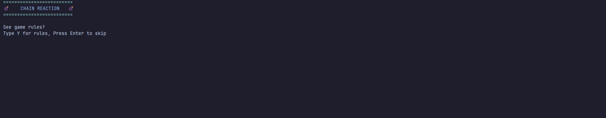
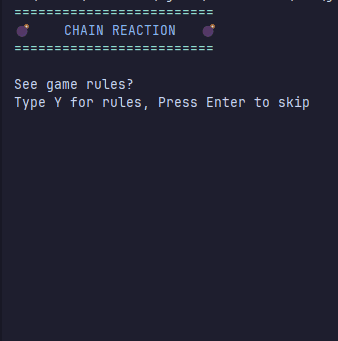
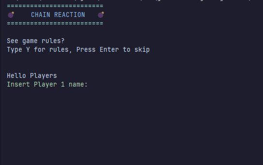
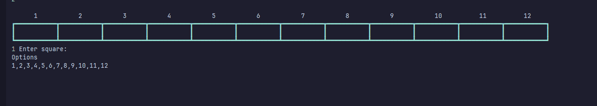
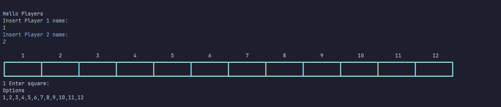
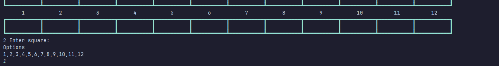
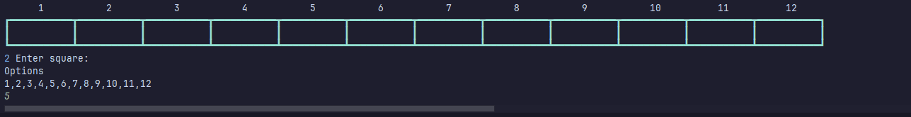
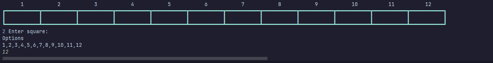
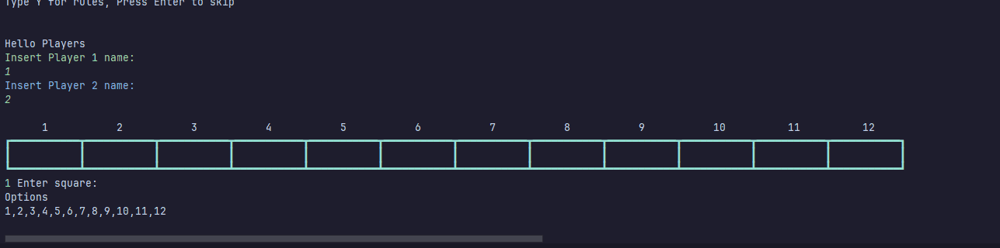
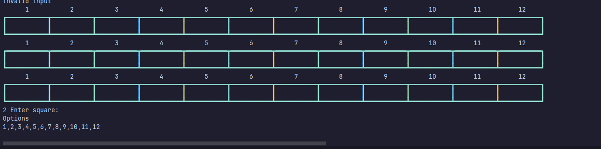

# Results of Testing

The test results show the actual outcome of the testing, following the [Test Plan](test-plan.md)

---

## Testing "see rules"

I will test if users can say yes to seeing game rules before playing

### Test Data To Use

I will imput "Y" for yes

### Test Result

The result was as expected

---

## Testing "see rules"

I will test if users can skip seeing game rules before playing

### Test Data Used

I will press enter

### Test Result

The result was as expected

---

## Testing player names

I will test the entering user names

### Test Data To Use

I will insert the names Bob and NotBob

### Test Result

the result was as expected

---

## Testing player moves

Testing player ones first move

### Test Data To Use

I will try to input 1

### Test Result

the result was as expected

---

## Testing player moves

Testing player ones first move

### Test Data To Use

I will try to input 5

### Test Result

the result was as expected

---

## Testing player moves

Testing player ones first move

### Test Data To Use

I will try to input 12

### Test Result

the result was as expected

---

## Testing player moves

Testing player twos first move

### Test Data To Use

I will try to input 1

### Test Result

the result was as expected

---

## Testing player moves

Testing player twos first move

### Test Data To Use

I will try to input 5

### Test Result

the result was as expected

---

## Testing player moves

Testing player twos first move

### Test Data To Use

I will try to input 12

### Test Result

the result was as expected

---

## Testing bomb

Testing to see what happens when player 1 places three counters in a row

### Test Data To Use

I will place three counters in a row

### Test Result

the result was as expected

---

## Testing bomb

Testing to see what happens when player 2 places three counters in a row

### Test Data To Use

I will place three counters in a row

### Test Result

the result was as expected

---

## Example Test Name

Example test description. Example test description.Example test description. Example test description.Example test description. Example test description.

### Test Data Used

Details of test data. Details of test data. Details of test data. Details of test data. Details of test data. Details of test data. Details of test data.

### Test Result

Comment on test result. Comment on test result. Comment on test result. Comment on test result. Comment on test result. Comment on test result.

---

